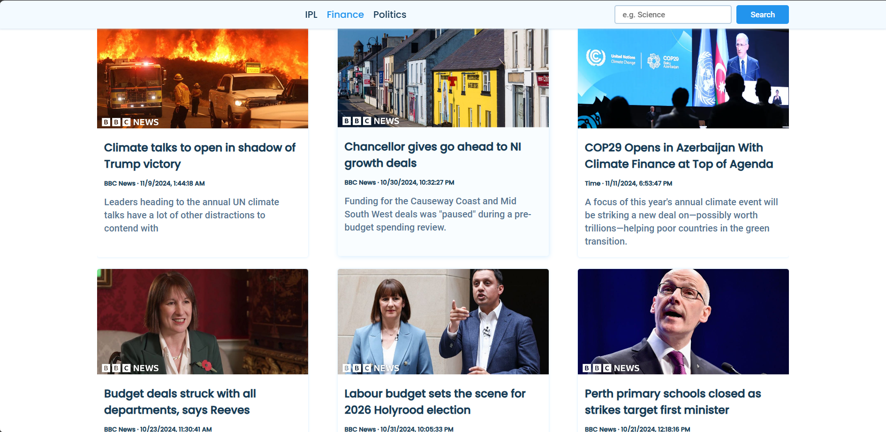

# News App

This project is a simple news application that displays recent news articles from various categories such as Finance, Politics, and Climate. The interface is user-friendly, allowing users to browse the latest headlines and stay updated with current events.

## Features
- Displays news articles from different categories.
- Organized layout for easy reading.
- Categories include Finance, Politics, and Climate.

## Screenshot
Here’s a preview of the app layout:



## Getting Started

### Prerequisites
To run this project, you need an API key from a news provider.

### Steps to Set Up the API Key
1. Go to a news API provider website, such as [News API](https://newsapi.org/).
2. Sign up and create a new account if you don’t already have one.
3. After logging in, navigate to the "Get API Key" section.
4. Copy your API key.
5. In the project directory, open the `script.js` file.
6. Find the placeholder text or variable where the API key should be inserted. It might look something like this:
    ```javascript
    const apiKey = 'YOUR_API_KEY_HERE';
    ```
7. Replace `'YOUR_API_KEY_HERE'` with your actual API key:
    ```javascript
    const apiKey = 'YOUR_ACTUAL_API_KEY';
    ```
8. Save the file.

### Running the Project

1. Clone the repository:
    ```bash
    git clone https://github.com/HitanshuShahare/News-App.git
    ```

2. Navigate into the project directory:
    ```bash
    cd News-App
    ```

3. Open `index.html` in your browser to view the app.

## Project Structure
- **index.html** - Main HTML file for the app layout and structure.
- **style.css** - Stylesheet that controls the look and feel of the app.
- **script.js** - JavaScript file that handles the functionality, including fetching and displaying news articles.

## Technologies Used
- HTML
- CSS
- JavaScript

## Contributing
If you'd like to contribute, please fork the repository and make changes as you'd like. Pull requests are warmly welcomed.
